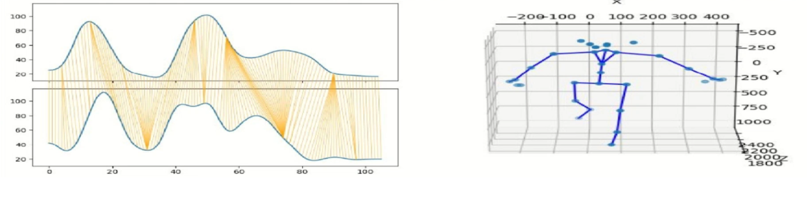
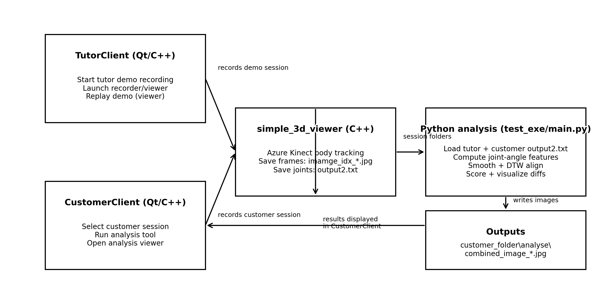

# TrainerCam: Human Motion Assessment for Rehabilitation

TrainerCam is a rehabilitation exercise coaching prototype that records human motion with Azure Kinect, extracts 3D skeleton joints, compares a user's movement with a tutor demonstration, and visualizes motion differences.

> **Current implementation scope:** this repository provides modular Azure Kinect live/MKV capture, Qt tutor/customer prototypes, persistent body-ID locking with session gates, confidence-aware preprocessing, streaming corrective feedback, configurable offline DTW assessment, structured scoring reports, aligned post-session movement review, and user-controlled voice feedback. RGB/mobile capture and clinically calibrated profiles remain planned work rather than completed capabilities.



*Motion comparison visualization. Left: Dynamic Time Warping alignment between tutor and user joint-angle trajectories. Right: a 3D skeleton reconstructed from Azure Kinect body-tracking data.*

## Overview

The system provides an end-to-end workflow for recording and comparing rehabilitation exercises:

```text
Tutor demonstration
        ↓
Azure Kinect body tracking
        ↓
3D skeleton extraction
        ↓
Joint-angle feature computation
        ↓
User exercise recording
        ↓
Temporal alignment with Dynamic Time Warping
        ↓
Motion score and frame-level visualization
```

The project includes:

- C++ programs for Azure Kinect body tracking and data recording
- Qt desktop interfaces for tutor and customer workflows
- Python scripts for skeleton processing, motion alignment, scoring, and visualization
- Playback utilities for recorded image sequences

The recorder exposes one capture-source boundary for a live Azure Kinect and a recorded Azure Kinect MKV. Driver configuration, offline file selection and extension rules are documented in [docs/MODULAR_CAPTURE.md](docs/MODULAR_CAPTURE.md).

## Method

The motion-comparison pipeline consists of the following steps:

1. Capture RGB frames and 3D body-joint coordinates using Azure Kinect Body Tracking.
2. Extract angle-based motion features from selected body joints.
3. Lock one subject inside the configured training region and reject unstable sessions.
4. Repair short low-confidence gaps and reject unusable frames.
5. Normalize the skeleton by body origin, scale, and torso orientation.
6. Smooth motion trajectories using a Gaussian filter.
7. Align tutor and user sequences with Dynamic Time Warping.
8. Compute distances between aligned frames.
9. Produce either a quality report, aggregate score, or frame-level visualization.

Dynamic Time Warping allows exercises performed at different speeds to be compared by aligning corresponding stages of the motion.

## Repository Structure

### `simple_3d_viewer/`

**C++ · Azure Kinect Body Tracking · OpenCV**

Records a body-tracking session to a folder supplied as a command-line argument.

Generated files include:

- `session.json`: versioned session metadata and coordinate conventions
- `frames.jsonl`: timestamped frames containing all bodies, joint poses and confidence
- `output2.txt`: transitional legacy skeleton export
- `image_idx_<frame>.jpg`: RGB frames captured during the session
- `imamge_idx_<frame>.jpg`: temporary compatibility alias for older visualization code

The complete format and migration policy are documented in [docs/MOTION_DATA_FORMAT.md](docs/MOTION_DATA_FORMAT.md).

### `TutorClient/`

**Qt · C++**

Tutor-side desktop application that:

- creates a new recording folder;
- launches the Azure Kinect recorder;
- captures a tutor demonstration;
- replays previously recorded demonstrations when the playback tool is available.

### `CustomerClient/`

**Qt · C++**

Customer-side desktop application that:

- displays available customer recordings;
- compares a selected customer session with a tutor demonstration;
- launches the analysis workflow;
- displays generated comparison frames.

### `test_exe/`

**Python · NumPy · SciPy · Dynamic Time Warping**

The core motion-comparison logic is implemented in:

```text
test_exe/main.py
```

It:

1. loads tutor and customer motion-session v1 data, with `output2.txt` fallback;
2. computes joint-angle features;
3. applies Gaussian smoothing;
4. aligns the motion sequences using a DTW warping path;
5. computes distances between aligned frames;
6. prints a motion score or generates analysis visualizations.

Supported modes:

- `--function tracking`: reports locked body IDs, training-region coverage and session-gate results;
- `--function realtime`: watches an active customer recording and emits stable corrective events;
- `--function quality`: reports joint coverage, interpolation and usable frames;
- `--function report`: prints a structured overall and per-feature assessment;
- `--function artifacts`: writes requested assessment, feedback and review files without opening a diagnostic viewer;
- `--function score`: prints an aggregate motion-comparison score;
- `--function showVideos`: generates frame-level analysis images.

Generated analysis images are saved under:

```text
<customer_folder>/analyse/
```

### `show_videos/`

**Python**

Plays an image sequence matching `*_idx_*.jpg` as a lightweight video viewer.

## Expected Recording Layout

Each tutor or customer recording folder should contain:

```text
session_folder/
├── session.json
├── frames.jsonl
├── output2.txt
├── image_idx_0.jpg
├── image_idx_1.jpg
├── image_idx_2.jpg
└── ...
```

## Running the Python Analysis

For the complete Windows, Qt, Azure Kinect, and OpenCV environment baseline, see [docs/BUILDING.md](docs/BUILDING.md).

### Verify the offline baseline

The repository includes synthetic, privacy-safe skeleton sessions and automated regression tests. From PowerShell:

```powershell
.\scripts\verify_baseline.ps1
```

This validates configuration, compiles the Python sources, runs unit tests, and computes a score from the committed sample sessions. Native build prerequisites that are unavailable are reported as warnings.

### 1. Install dependencies

```bash
pip install -r requirements.txt
```

### 2. Compute a motion score

```bash
python test_exe/main.py \
  --folder_tutor "PATH_TO_TUTOR_SESSION" \
  --folder_customer "PATH_TO_CUSTOMER_SESSION" \
  --function score
```

### 3. Generate analysis visualizations

```bash
python test_exe/main.py \
  --folder_tutor "PATH_TO_TUTOR_SESSION" \
  --folder_customer "PATH_TO_CUSTOMER_SESSION" \
  --function showVideos
```

The generated visualization frames are saved under:

```text
<customer_folder>/analyse/
```

The confidence handling, missing-joint repair, body normalisation and quality gates are documented in [docs/MOTION_PREPROCESSING.md](docs/MOTION_PREPROCESSING.md).

Persistent body-ID locking, the configurable training region, multi-person diagnostics, and pre-score session gates are documented in [docs/SUBJECT_TRACKING.md](docs/SUBJECT_TRACKING.md).

Online reference alignment, feedback hysteresis/cooldown, live overlays, event files, and latency measurement are documented in [docs/REALTIME_FEEDBACK.md](docs/REALTIME_FEEDBACK.md).

The accessible result window, user-facing summary format, language settings, and system voice feedback are documented in [docs/POST_SESSION_FEEDBACK.md](docs/POST_SESSION_FEEDBACK.md).

The native side-by-side movement review, DTW timeline, key-issue bookmark and safe image resolution are documented in [docs/POST_SESSION_REVIEW.md](docs/POST_SESSION_REVIEW.md).

Exercise-specific features, weights, tolerances, feedback, and the assessment report are documented in [docs/SCORING_AND_PROFILES.md](docs/SCORING_AND_PROFILES.md). The default engineering profile is `config/exercises/arm_raise.json`.

## Project Contributions

I independently developed the main components of this project, including:

- the Azure Kinect body-tracking and recording workflow;
- the tutor-side and customer-side Qt interfaces;
- 3D skeleton data processing;
- joint-angle feature extraction;
- Gaussian smoothing of motion trajectories;
- Dynamic Time Warping alignment;
- motion-comparison scoring;
- frame-level visualization generation;
- integration between the recording, analysis, and playback components.

## System Diagram



## Privacy and Repository Notes

- Build outputs, binaries, large dependencies, NuGet packages, OpenCV DLLs, and PyInstaller `dist/` and `build/` directories are excluded through `.gitignore`.
- RGB recordings and body-tracking data may contain sensitive personal information.
- Real patient recordings should not be uploaded to a public repository.
- This repository contains source code and example visualizations, but no private rehabilitation data.
